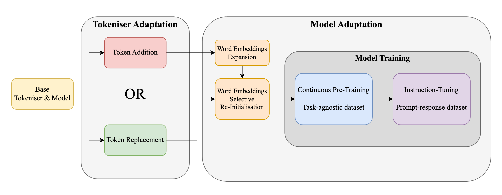

# Language Model Adaptation for Low-Resource African Languages 🌍

This repository contains code used in the _Language Model Adaptation for Low-Resource African Languages_ project.

The corresponding trained and adapted tokenizers as well as models can be found on the [HuggingFace site](https://huggingface.co/TheRootOf3/low-resource-language-model-adaptation) of the project.

## Structure of the repository:

- `evaluation/` - Code used for model evaluation on downstream tasks. In addition contains processed results.
- `modelling/` - Functions for model embedding matrix modifications.
- `scripts/` - Bash scripts for dataset processing, tokenizer and model training and model adaptation. Scripts come with SGE scheduler flags.
- `tokenization/` - Functions for tokenizer adaptation.
- `training/` - Functions for training dataset pre-processing and model training.
- `fertility_analysis/` - Fertility evaluation results of selected tokenizers.
- `add_tokens.py` - Tokenizer adaptation through token addition.
- `replace_tokens.py` - Tokenizer adaptation through token replacement.
- `add_embeddings.py`- Model embedding matrix modification through embedding addition.
- `replace_embeddings.py` - Model embedding matrix modification through embedding replacement.
- `fertility_evaluation.py` - Script used for tokenizer fertility evaluation on WURA validation sets.
- `train_model.py` - Model training script.
- `train_wura_tokenizer.py` - Script used for training language-dedicated tokenizers using the WURA dataset.
- `requirements.txt` - A file containing a list of Python pip packages.
- `README.md` - This file :)

## Results reproduction

Download data:

1. [WURA](https://huggingface.co/datasets/castorini/wura) dataset and place it in a `./data/wura` directory.

To reproduce the tokenizer fertility results, run the following scripts:

1. Train language-dedicated tokenizers using `scripts/train_wura_tokenizers_opt.qsub.sh`.
2. Run `add_tokens.py` and `replace_tokens.py` to produce adapted tokenizers.
3. Specify paths to desired tokenizers and run `fertility_evaluation.py`.

To reproduce model adaptation results, run the above and the following:

1. Run `add_embeddings.py` and `replace_embeddings.py` to create models with modified embeddings.
2. Run all scripts from `scripts/dataset_processing` to pre-process, tokenize and group training samples.
3. Train models using scripts from `scripts/model_training`.
4. Run `scripts/download_evaluation_data_repos.sh` to download evaluation datasets.
5. Evaluate models
   1. Generate model answers by running scripts in `scripts/model_evaluation`.
   2. Aggregate and compute metrics using scripts from `scripts/evaluation_results_processing`.
